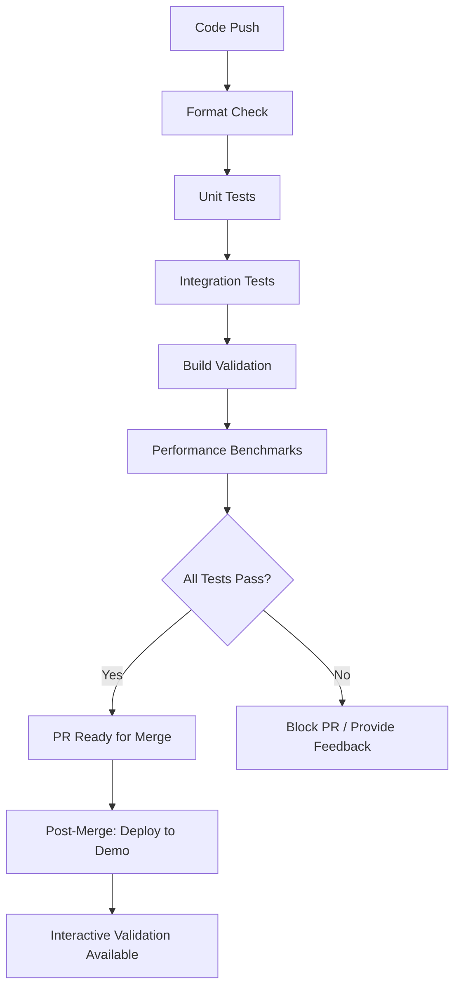

# CI/CD Testing Workflow

**Pipeline**: GitHub Actions  
**Strategy**: Fast Feedback with Quality Gates  
**Automation Level**: Fully Automated Unit/Integration + Manual Interactive Validation  
**Date**: August 1, 2025  

## 🎯 **CI/CD Testing Philosophy**

Our CI/CD testing workflow is designed around **fast feedback** and **quality gates**, ensuring:

- ✅ **Immediate feedback** on code quality (Unit Tests in < 30 seconds)
- ✅ **Comprehensive validation** before merge (Integration Tests)
- ✅ **Visual confirmation** available on-demand (Interactive Validation)
- ✅ **Performance monitoring** with automated benchmarks
- ✅ **Zero-friction development** with automated quality checks

## 🚀 **Testing Pipeline Overview**



## 📋 **Pipeline Stages**

### **Stage 1: Code Quality (Fast)**
**Duration**: < 10 seconds  
**Purpose**: Immediate feedback on code formatting and basic issues

```yaml
# .github/workflows/ci.yml
- name: Check Code Formatting
  run: |
    dotnet format --verify-no-changes --verbosity diagnostic
    
- name: Restore Dependencies
  run: dotnet restore
  
- name: Build Solution
  run: dotnet build --configuration Release --no-restore
```

**Quality Gates**:
- ✅ Code follows consistent formatting standards
- ✅ Solution builds without errors
- ✅ All dependencies resolve correctly

### **Stage 2: Unit Testing (Fast)**
**Duration**: < 30 seconds  
**Purpose**: Validate business logic and calculations

```yaml
- name: Run Unit Tests
  run: |
    dotnet test tests/GanttComponents.Tests/Unit/ \
      --configuration Release \
      --logger trx \
      --collect:"XPlat Code Coverage" \
      --results-directory ./test-results
      
- name: Generate Coverage Report
  run: |
    dotnet tool install -g dotnet-reportgenerator-globaltool
    reportgenerator \
      -reports:**/coverage.cobertura.xml \
      -targetdir:coverage \
      -reporttypes:Html
```

**Quality Gates**:
- ✅ All unit tests pass (100% success rate)
- ✅ Code coverage >= 80% for business logic
- ✅ No test execution timeouts
- ✅ Memory usage within bounds

### **Stage 3: Integration Testing (Medium)**
**Duration**: < 60 seconds  
**Purpose**: Validate service coordination and cross-component behavior

```yaml
- name: Run Integration Tests
  run: |
    dotnet test tests/GanttComponents.Tests/Integration/ \
      --configuration Release \
      --logger trx \
      --collect:"XPlat Code Coverage" \
      --results-directory ./test-results
      
- name: Performance Benchmark
  run: |
    dotnet run --project tests/GanttComponents.Benchmarks \
      --configuration Release \
      -- --memory --filter "*ZoomCalculation*"
```

**Quality Gates**:
- ✅ All integration tests pass (100% success rate)
- ✅ Service coordination works correctly
- ✅ Performance benchmarks within thresholds
- ✅ No memory leaks detected

### **Stage 4: Build Validation (Medium)**
**Duration**: < 30 seconds  
**Purpose**: Ensure application builds and runs correctly

```yaml
- name: Build Demo Application
  run: |
    dotnet publish src/GanttComponents/ \
      --configuration Release \
      --output ./publish
      
- name: Verify Demo Startup
  run: |
    timeout 30s dotnet ./publish/GanttComponents.dll &
    sleep 10
    curl -f http://localhost:5000/health || exit 1
```

**Quality Gates**:
- ✅ Application builds without warnings
- ✅ Demo application starts successfully
- ✅ Health check endpoint responds
- ✅ No runtime initialization errors

## 🎭 **Branch-Specific Workflows**

### **Feature Branch Workflow**
```yaml
name: Feature Branch CI
on:
  push:
    branches: 
      - 'feat/**'
      - 'fix/**'
      - 'docs/**'
      - 'test/**'

jobs:
  fast-validation:
    runs-on: ubuntu-latest
    steps:
      - uses: actions/checkout@v4
      - name: Setup .NET
        uses: actions/setup-dotnet@v3
        with:
          dotnet-version: '8.0.x'
      
      # Stage 1: Code Quality (Required)
      - name: Format Check
        run: dotnet format --verify-no-changes
        
      # Stage 2: Unit Tests (Required)  
      - name: Unit Tests
        run: dotnet test tests/GanttComponents.Tests/Unit/
        
      # Stage 3: Integration Tests (Required for non-docs)
      - name: Integration Tests
        if: "!startsWith(github.ref, 'refs/heads/docs/')"
        run: dotnet test tests/GanttComponents.Tests/Integration/
```

### **Pull Request Workflow**
```yaml
name: Pull Request Validation
on:
  pull_request:
    branches: [main]

jobs:
  comprehensive-validation:
    runs-on: ubuntu-latest
    steps:
      # All stages required for PR merge
      - name: Full Test Suite
        run: |
          dotnet test --configuration Release \
            --logger trx \
            --collect:"XPlat Code Coverage"
            
      - name: Performance Validation
        run: |
          dotnet run --project tests/GanttComponents.Benchmarks \
            --filter "*Critical*"
            
      - name: Security Scan
        uses: github/super-linter@v4
        env:
          DEFAULT_BRANCH: main
          GITHUB_TOKEN: ${{ secrets.GITHUB_TOKEN }}
```

### **Main Branch Workflow**
```yaml
name: Main Branch Deployment
on:
  push:
    branches: [main]

jobs:
  deploy-demo:
    runs-on: ubuntu-latest
    steps:
      # Full validation + deployment
      - name: Deploy to Demo Environment
        run: |
          # Build and deploy demo application
          # Make interactive validation available
          
      - name: Update Documentation
        run: |
          # Auto-generate API docs
          # Update coverage reports
```

## ⚡ **Performance Monitoring**

### **Automated Benchmarks**
```yaml
- name: Run Performance Benchmarks
  run: |
    dotnet run --project tests/GanttComponents.Benchmarks \
      --configuration Release \
      -- --memory --exporters json
      
- name: Performance Regression Check
  run: |
    # Compare with baseline performance
    python scripts/check-performance-regression.py \
      --current ./BenchmarkDotNet.Artifacts/results.json \
      --baseline ./performance-baselines/main.json \
      --threshold 10  # 10% regression threshold
```

### **Performance Targets**
```csharp
[MemoryDiagnoser]
[SimpleJob(RuntimeMoniker.Net80)]
public class ZoomCalculationBenchmarks
{
    [Params(100, 500, 1000)]
    public int TaskCount { get; set; }

    [Benchmark]
    [MemoryDiagnoser]
    public void ZoomCalculation_AllLevels()
    {
        // Benchmark zoom calculations
        // Target: <100ms for 1000 tasks across all zoom levels
    }
}
```

**Automated Performance Gates**:
- ✅ **Zoom Calculations**: <100ms for 1000 tasks
- ✅ **Memory Usage**: <10MB for typical operations
- ✅ **Startup Time**: <5 seconds for demo application
- ✅ **No Performance Regression**: <10% slower than baseline

## 🔍 **Test Result Reporting**

### **GitHub Checks Integration**
```yaml
- name: Publish Test Results
  uses: dorny/test-reporter@v1
  if: success() || failure()
  with:
    name: Test Results
    path: '**/test-results/*.trx'
    reporter: dotnet-trx
    fail-on-error: true
    
- name: Code Coverage Report
  uses: irongut/CodeCoverageSummary@v1.3.0
  with:
    filename: coverage/**/coverage.cobertura.xml
    badge: true
    fail_below_min: true
    format: markdown
    hide_branch_rate: false
    hide_complexity: true
    indicators: true
    output: both
    thresholds: '60 80'
```

### **PR Comment Integration**
```yaml
- name: Comment PR with Results
  uses: actions/github-script@v6
  if: github.event_name == 'pull_request'
  with:
    script: |
      const fs = require('fs');
      const coverage = fs.readFileSync('code-coverage-results.md', 'utf8');
      
      github.rest.issues.createComment({
        issue_number: context.issue.number,
        owner: context.repo.owner,
        repo: context.repo.repo,
        body: `## 🧪 Test Results\n\n${coverage}`
      });
```

## 📊 **Quality Metrics Dashboard**

### **Automated Metrics Collection**
```yaml
- name: Collect Quality Metrics
  run: |
    # Test execution times
    echo "unit_test_duration_seconds $(cat test-timing.txt)" >> metrics.txt
    
    # Code coverage percentage
    echo "code_coverage_percentage $(cat coverage-percentage.txt)" >> metrics.txt
    
    # Performance benchmark results
    echo "zoom_calculation_ms $(cat benchmark-results.txt)" >> metrics.txt
    
- name: Update Quality Dashboard
  run: |
    curl -X POST "${{ secrets.METRICS_ENDPOINT }}" \
      -H "Content-Type: application/json" \
      -d @metrics.json
```

### **Trend Monitoring**
- ✅ **Test Execution Time Trends**: Monitor for CI/CD performance degradation
- ✅ **Code Coverage Trends**: Ensure coverage maintains or improves
- ✅ **Performance Benchmark Trends**: Detect performance regressions early
- ✅ **Build Success Rate**: Track overall pipeline reliability

## 🛠 **Interactive Validation Integration**

### **Demo Environment Deployment**
```yaml
- name: Deploy Interactive Validation
  if: github.ref == 'refs/heads/main'
  run: |
    # Deploy demo application with interactive validation pages
    docker build -t gantt-demo .
    docker run -d -p 5000:80 gantt-demo
    
    # Make available at: https://demo.gantt-components.dev
    
- name: Smoke Test Interactive Validation
  run: |
    # Verify interactive validation pages load
    curl -f https://demo.gantt-components.dev/gantt-composer-zoom-validation
```

### **Manual Validation Triggers**
```yaml
name: Manual Validation Request
on:
  workflow_dispatch:
    inputs:
      validation_type:
        description: 'Type of validation to run'
        required: true
        default: 'full'
        type: choice
        options:
          - 'full'
          - 'zoom-only' 
          - 'performance-only'

jobs:
  manual-validation:
    runs-on: ubuntu-latest
    steps:
      - name: Run Requested Validation
        run: |
          case "${{ github.event.inputs.validation_type }}" in
            "full")
              echo "Running full validation suite"
              # Run all interactive validation tests
              ;;
            "zoom-only")
              echo "Running zoom validation only"
              # Run zoom-specific validation
              ;;
            "performance-only")
              echo "Running performance validation only"
              # Run performance benchmarks
              ;;
          esac
```

## 🚨 **Failure Handling and Recovery**

### **Test Failure Analysis**
```yaml
- name: Analyze Test Failures
  if: failure()
  run: |
    # Collect failure artifacts
    mkdir -p failure-analysis
    cp -r test-results/ failure-analysis/
    cp -r logs/ failure-analysis/
    
    # Generate failure report
    python scripts/analyze-test-failures.py \
      --results failure-analysis/ \
      --output failure-report.md
      
- name: Upload Failure Artifacts
  if: failure()
  uses: actions/upload-artifact@v3
  with:
    name: test-failure-artifacts
    path: failure-analysis/
```

### **Automatic Recovery Actions**
```yaml
- name: Retry Flaky Tests
  if: failure() && contains(steps.test.outputs.stderr, 'flaky')
  run: |
    echo "Retrying potentially flaky tests..."
    dotnet test --filter "Category=Flaky" --retry 3
    
- name: Notify Team on Critical Failure
  if: failure() && github.ref == 'refs/heads/main'
  uses: 8398a7/action-slack@v3
  with:
    status: failure
    channel: '#dev-alerts'
    text: 'Main branch build failed! 🚨'
```

---

*Our CI/CD testing workflow provides fast, reliable feedback while maintaining high quality standards through automated testing and strategic manual validation checkpoints.*
